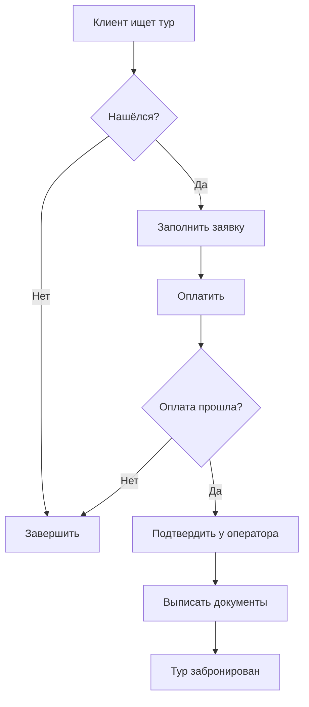
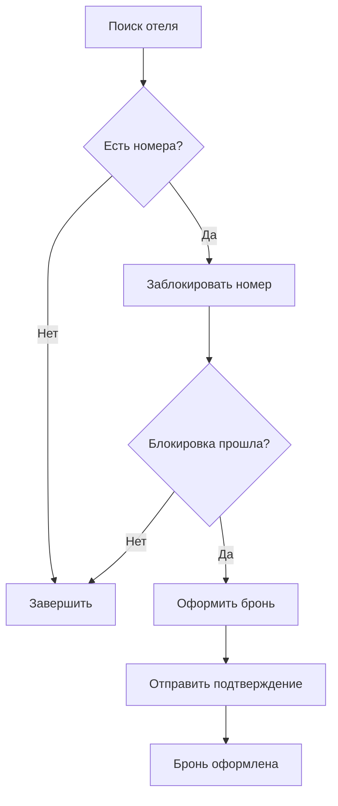
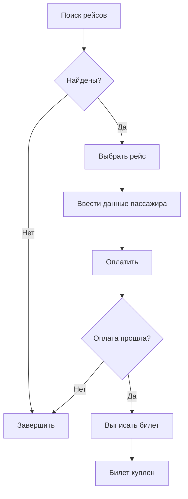
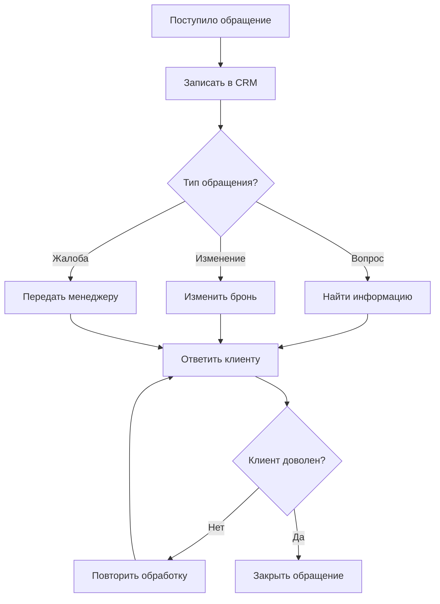

# BPMN-схемы для туроператора

## 1. Бронирование тура

```mermaid
flowchart TD
    A[Клиент ищет тур] --> B{Нашёлся?}
    B -->|Нет| C[Завершить]
    B -->|Да| D[Заполнить заявку]
    D --> E[Оплатить]
    E --> F{Оплата прошла?}
    F -->|Нет| C
    F -->|Да| G[Подтвердить у оператора]
    G --> H[Выписать документы]
    H --> I[Тур забронирован]
```

## 2. Бронирование отеля

```mermaid
flowchart TD
    A[Поиск отеля] --> B{Есть номера?}
    B -->|Нет| C[Завершить]
    B -->|Да| D[Заблокировать номер]
    D --> E{Блокировка прошла?}
    E -->|Нет| C
    E -->|Да| F[Оформить бронь]
    F --> G[Отправить подтверждение]
    G --> H[Бронь оформлена]
```

## 3. Покупка билетов

```mermaid
flowchart TD
    A[Поиск рейсов] --> B{Найдены?}
    B -->|Нет| C[Завершить]
    B -->|Да| D[Выбрать рейс]
    D --> E[Ввести данные пассажира]
    E --> F[Оплатить]
    F --> G{Оплата прошла?}
    G -->|Нет| C
    G -->|Да| H[Выписать билет]
    H --> I[Билет куплен]
```

## 4. Поддержка клиентов

```mermaid
flowchart TD
    A[Поступило обращение] --> B[Записать в CRM]
    B --> C{Тип обращения?}
    C -->|Вопрос| D[Найти информацию]
    C -->|Изменение| E[Изменить бронь]
    C -->|Жалоба| F[Передать менеджеру]
    D --> G[Ответить клиенту]
    E --> G
    F --> G
    G --> H{Клиент доволен?}
    H -->|Нет| I[Повторить обработку]
    I --> G
    H -->|Да| J[Закрыть обращение]
```
